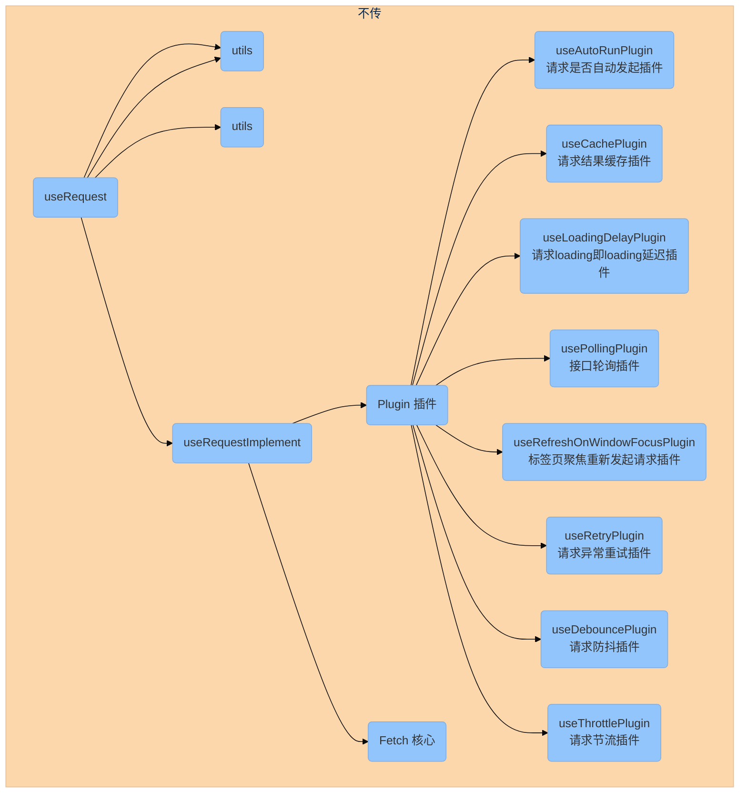

# useRequest

:::warning 提示
待完善
:::

- [ahooks-useRequest](https://ahooks.js.org/zh-CN/hooks/use-request/index)
- [ahooks-useRequest 分析](https://gpingfeng.github.io/ahooks-analysis/hooks/request/use-request)

useRequest 通过插件式组织代码，核心代码极其简单，并且可以很方便的扩展出更高级的功能。

useRequest 代码的设计架构

入口函数是去调用 `useRequestImplement` 这个函数, 并且将插件列表作为这个函数的参数传进去，而这个函数内部又使用了 Fetch 类来统一管理接口请求和插件

