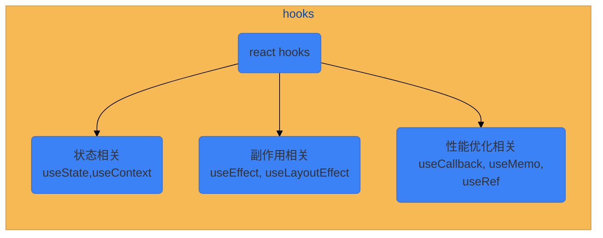
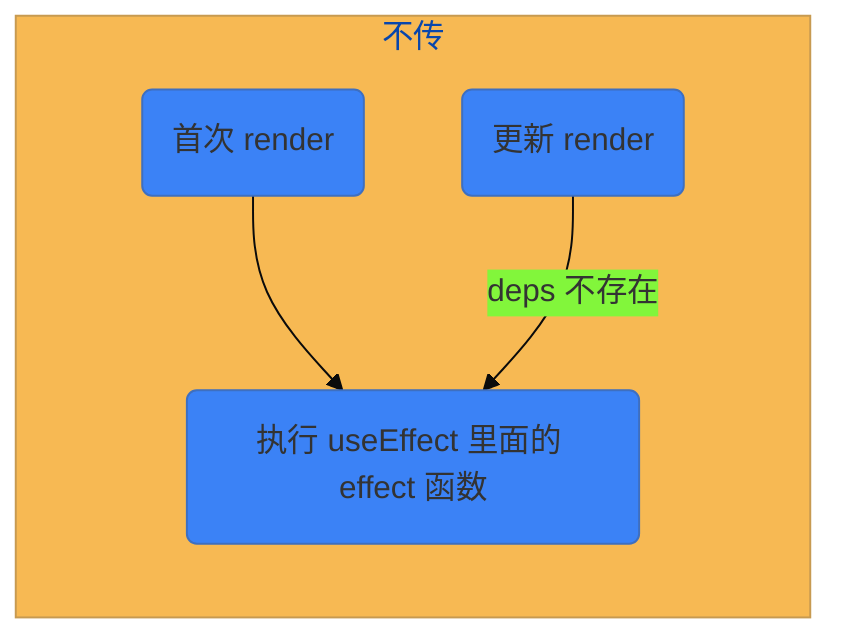
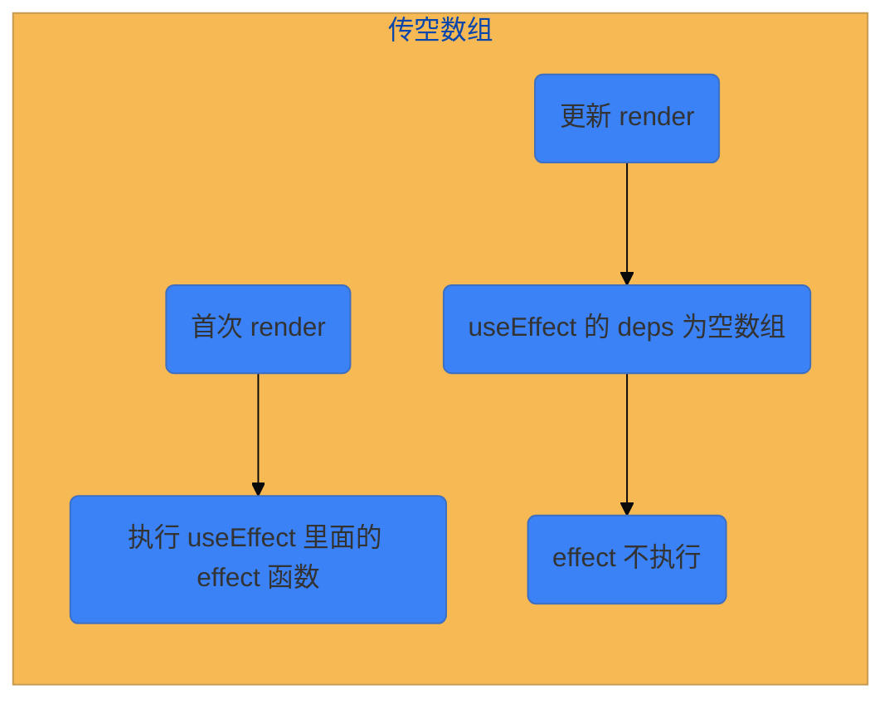
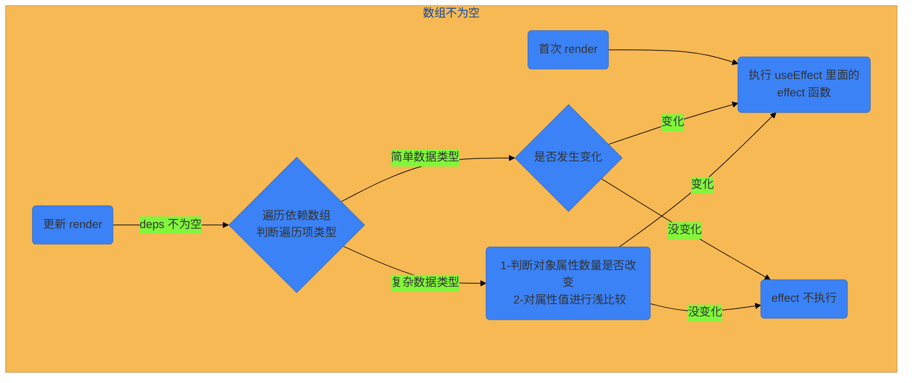
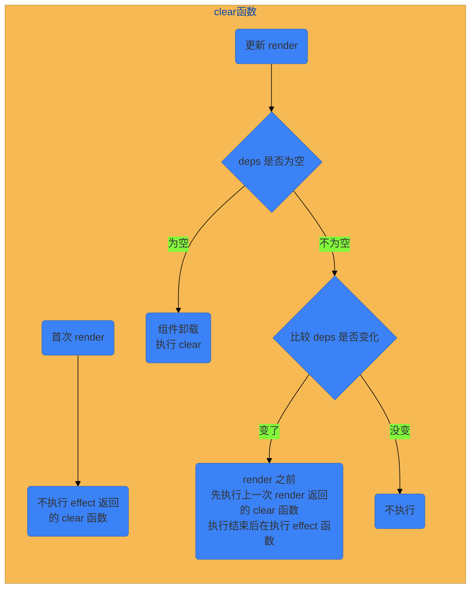
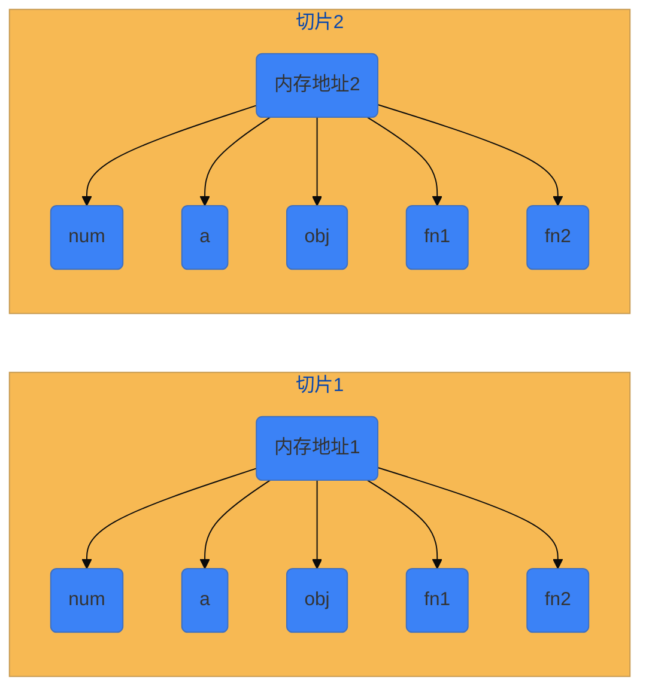
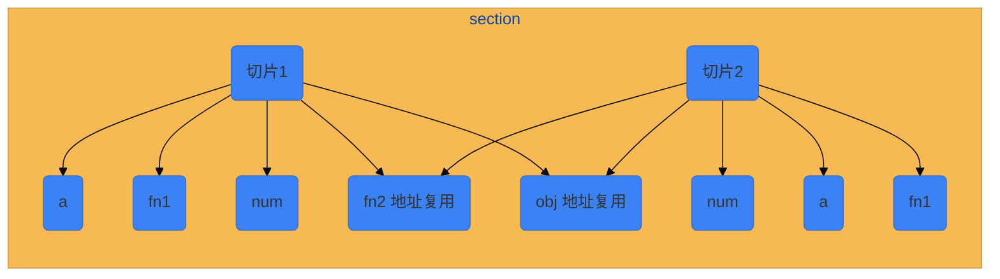

<!--
 * @Author: HfWang
 * @Date: 2023-05-31 19:04:18
 * @LastEditors: wanghaofeng
 * @LastEditTime: 2023-06-15 09:32:01
 * @FilePath: \code\whf-hooks-analysis\hooks\react-hooks.md
-->

# React Hooks 新手入坑指南

## 前言

:::tip 前言

- 想学习自定义 hooks 的源码，首先要知道 react 给我们提供了那些 hooks 的 api 或者说方法， 而本文将介绍一下几个日常开发中比较常用的 hooks
- 完整的 hooks 文档可以看 [react hooks api 官方文档](https://react.dev/reference/react)
  :::

对于常用的 react hooks，我把他们分为 3 类:



## 状态相关

### useState

```js
useState();
```

```js
import { useState } from "react";

const Demo = () => {
	const [count, setCount] = useState(0);
	return (
		<div>
			{count}
			<button onClick={() => setCount(count++)}>count+1</button>
			<button onClick={() => setCount((e) => (e += 2))}>count+2</button>
		</div>
	);
};
```

### useContext

这个一般是用于跨多层级组件之间的通信的，如葫芦娃爷爷和葫芦娃之间的通信, 一般搭配 createContetx

```tsx
interface UserData {
	userId: number;
	name: string;
	[key in string]: nay;
}

const initData: UserData = {};
const UserCtx = createContext<UserData>(initData);

const Demo = () => {
	const userData = fetch("xxx"); // 假设异步获取

	return (
		<UserCtx.UserCtx value={userData}>
			<Son />
		</UserCtx.UserCtx>
	);
};

const Son = () => (
	<div>
		<Grandson />
	</div>
);

const Grandson = () => {
	const userCtx: UserData = useContext(UserCtx);

	return <div>...</div>;
};
```

## 副作用相关

### useEffect

```js
/**
 * @param {function} effect
 * @param {Array} deps
 * @returns {void}
 */
useEffect(effect, deps);
```

effect 执行时机

:::code-group

```jsx [deps 不存在]
import { useEffect, useState } from "react";

const Demo = () => {
	const [count, setCount] = useState(0);
	const [num, setNum] = useState(0);

	useEffect(() => {
		console.log("无论是自身那个状态发生变化导致的更新或者是祖先组件导致的更新，我这里每次都会触发");
	});
	return (
		<div>
			<p>
				num: {num} count:{count}
			</p>
			<button onClick={() => setCount(count++)}>count</button>
			<button onClick={() => setNum(num++)}>num</button>
		</div>
	);
};
```

```jsx [deps 为空数组]
import { useEffect, useState } from "react";

const Demo = () => {
	useEffect(() => {
		console.log("我只在组件创建时触发，后续任何情况导致的组件更新，我都不会在执行了");
	}, []);

	return (
		<div>
			<p>
				num: {num} count:{count}
			</p>
		</div>
	);
};
```

```jsx [deps 有值]
import { useEffect, useState } from "react";

const Demo = () => {
	const [count, setCount] = useState(0);
	const [num, setNum] = useState(0);

	useEffect(() => {
		console.log("我只在 count 变量发生变化时才触发");
	}, [count]);
	return (
		<div>
			<p>
				num: {num} count:{count}
			</p>
			<button onClick={() => setCount(count++)}>count</button>
			<button onClick={() => setNum(num++)}>num</button>
		</div>
	);
};
```

:::

useEffect 第二个参数：

- 不传



- 传空数组



- 数组不为空
  - 数组里为简单数据类型
  - 数组里为复杂数据类型



如果 useEffect 的依赖项数组中包含对象，React 会检查对象属性是否发生变化。如果属性的顺序、值或对象本身引用发生变化，则会触发 useEffect。

:::code-group

```jsx [deps 为空]
import { useEffect, useState } from "react";

const Demo = () => {
	const [count, setCount] = useState(0);

	useEffect(() => {
		return () => {
			console.log("我在组件卸载时触发");
		};
	}, []);
	return (
		<div>
			<p>count:{count}</p>
			<button onClick={() => setCount(count++)}>count</button>
		</div>
	);
};
```

```jsx [deps 有值]
import { useEffect, useState } from "react";

const Demo = () => {
	const [count, setCount] = useState(0);

	useEffect(() => {
		return () => {
			console.log("我在 count 导致的下一次渲染之前执行");
		};
	}, [count]);
	return (
		<div>
			<p>count:{count}</p>
			<button onClick={() => setCount(count++)}>count</button>
		</div>
	);
};
```

:::

useEffect 中 return 的执行时机：

- 首次渲染：不会执行 useEffect 里面的 return 函数
- 组件重新 render，useEffect 执行时，`会先执行 useEffect 里面的 return 函数，后面在执行非 return 部分的代码`



### uselayoutEffect

略，基础语法和 useEffect 一模一样，只有执行时机不一致，具体可以看下面的执行时机图：


useLayoutEffect 主要用于模拟 uselaytmeffect 行为，其实现原理是将 useEffect 的依赖项数组中添加 shallowCompare 函数，使得 useEffect 在每次使用浅比较时，都会触发重渲染并执行 useLayoutEffect。

`useLayoutEffect 可以用于处理可能需要阻塞视图的副作用，如节流、防抖、重排等`

但是，官方建议尽量使用 useEffect，以避免阻塞视觉更新。

## 性能优化相关

### 原理简介

了解这几个 hooks 需要先知道`时间切片`这个概念

比如现在有一个变量 num 从 1 ==> 2, 对于 react 来说就是存在两个时间切片

- 切片 1：num = 1
- 切片 2：num = 2

而对于一个时间切片来说，它上面包含了一个组件上的所有`数据，包括状态、函数`等

比如下面这个例子

```js
let num = 1,
	a = 0;
const obj = { a };
const fn1 = () => num++;
const ffn2 = () => a++;
```

对于 react 来说，每次状态发生变化，都会重新生成一个对象，对于上面这个例子了来说就是，num 变化了，react 会生成新的 num、a、obj、fn1、fn2，即

- 切片 1： num a obj fn1 fn2
- 切片 2： num a obj fn1 fn2 （全都是新的内存地址，只是变量和函数的名称一致）



但是对于 fn2 和 obj 来说，其实它们都不依赖 num，所以我们希望在更新的时候，如果函数或变量本身并不依赖到变化的变量，任然能使用上一切片时间的变量和函数，
即 obj 和 fn2 在更新的时候任然使用 切片 1 的 obj、fn2 对应的内存地址,这样在更新的时候就可以减少一部分的性能开销，如图所示



> 这里如果熟悉 vue 的话可以来理解为 vue 里面的 computed

针对这种场景下的需求，react 为我们提供了这么几个 hooks

- useRef
- useMemo
- useCallback

`那什么时候能使用更新前的内存地址呢? 什么是需要创建新的内存地址呢？`

react 的 useMemo 和 useCallback 是通过第二个参数来判断的

同 useEffect 一样，会对第二个参数进行比较，如果依赖项的数据发生了变化，就创建新的内存地址，如果第二个参数是空数组的话，即创建之后，之后组件的每一次跟新，被 `useMemo / useCallback` 包装过的变量、函数都不会在发生变化

```js
const Demo = () => {
	const a = useRef(0);
	const fn1 = useCallback(() => console.log(a.current), []);
	const fn2 = useCallback(() => console.log(a.current), [a]);

	return <div>....</div>;
};
```

如上，假设 a 变成了 1，让后去执行 fn1 和 fn2，这是会发现，fn1 打印的还是 0， 而 fn2 打印的是 1，这就是上面说的时间切片导致的，

- 时间切片 1 a = 0 fn1 里面的 a.current = 0, fn2 里面的 a.current = 0
- 时间切片 2 a = 1 fn1 里面的 a.current = 0, fn2 里面的 a.current = 1

:::tip
因为 fn1 的依赖项是空的，即 时间切片 2 中的 fn1 指向的内存地址还是时间内切片 1 中 fn1 所在的内存地址，所以 fn1 函数里面的 a 一直是第一个时间切片里面的数值，所以执行 fn1 的时候还是打印的 0，而 fn2 依赖性数值包含了 a, 所以在 a 发生变化的时候，在时间切片 2 中就会生成一个新的内存地址，函数里面的 a 变量就是时间切片 2 里面的 a 变量
:::

这就是 hooks 经常被提及的会导致 `闭包` 问题

### useMemo

```js
/**
 * @param {function} fn
 * @param {array} deps
 * @returns {any}
 */
useMemo(fn, deps);
```

```jsx
import React, { useMemo, useState } from "react";

export default function Demo() {
	const [num1, setNum1] = useState(0);
	const [num2, setNum2] = useState(0);
	const [num3, setNum3] = useState(0);

	const memoFn1 = useMemo(() => setNum((num1) => num1++), []);
	const memoFn2 = useMemo(() => setNum((num2) => num2++), [num2]);
	const fn3 = () => setNum((num) => num++);

	return (
		<div>
			<p>{num1}</p>
			<button onCLick={memoFn1}></button>
			<p>{num2}</p>
			<button onCLick={memoFn2}></button>
			<p>{num1}</p>
			<button onCLick={fn3}></button>
		</div>
	);
}
```

### useCallback

```js
/**
 * @param {function} fn
 * @param {array} deps
 * @returns {function}
 */
useCallback(fn, deps);
```

useCallback 实际上是 useMemo 的延申

```js
const fn1 = () => {};
useCallback(() => fn1(), [xxx]);
等价于;
useMemo(() => () => fn1(), [xxx]);
```

### useRef

相比于 setState 每次跟新都会生成一个新的对象，useRef 返回的对象内存地址时不变的，使用场景一般用于复杂类的实例创建

> useRef 创建的是一个普通 Javascript 对象，而且会在每次渲染时返回同一个 ref 对象，当我们变化它的 current 属性的时候，对象的引用都是同一个

```js
import { useRef } from "react";

const Demo = () => {
	const count = useRef(0);
	return (
		<div>
			{count}
			<button onClick={() => count.current++}>count+1</button>
		</div>
	);
};
```
