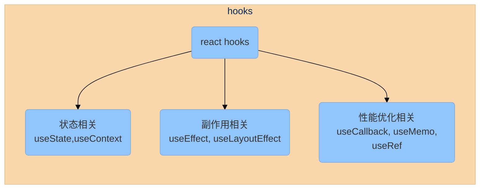
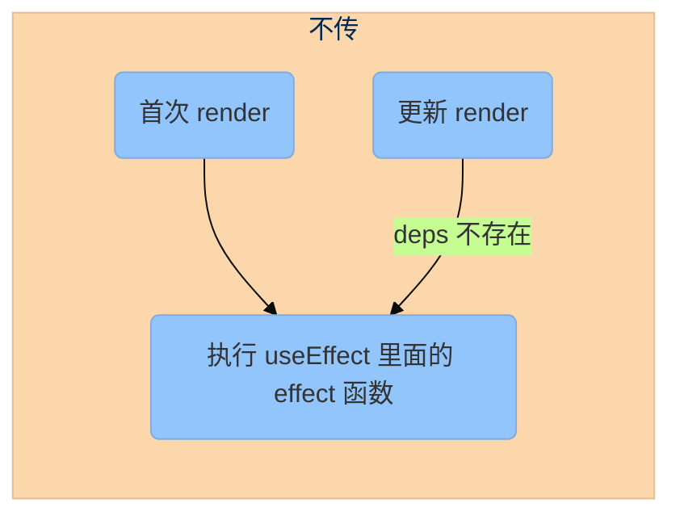
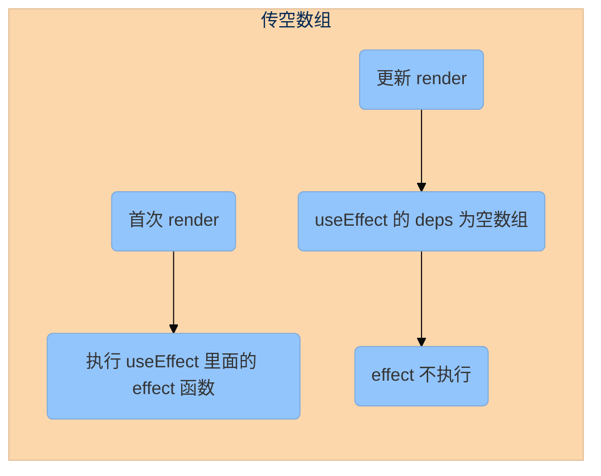
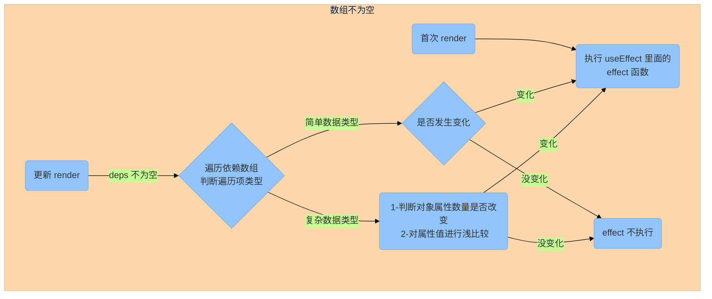
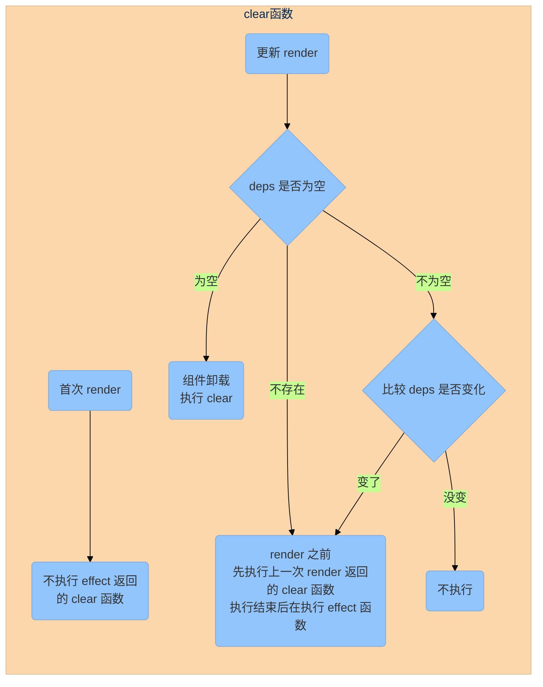
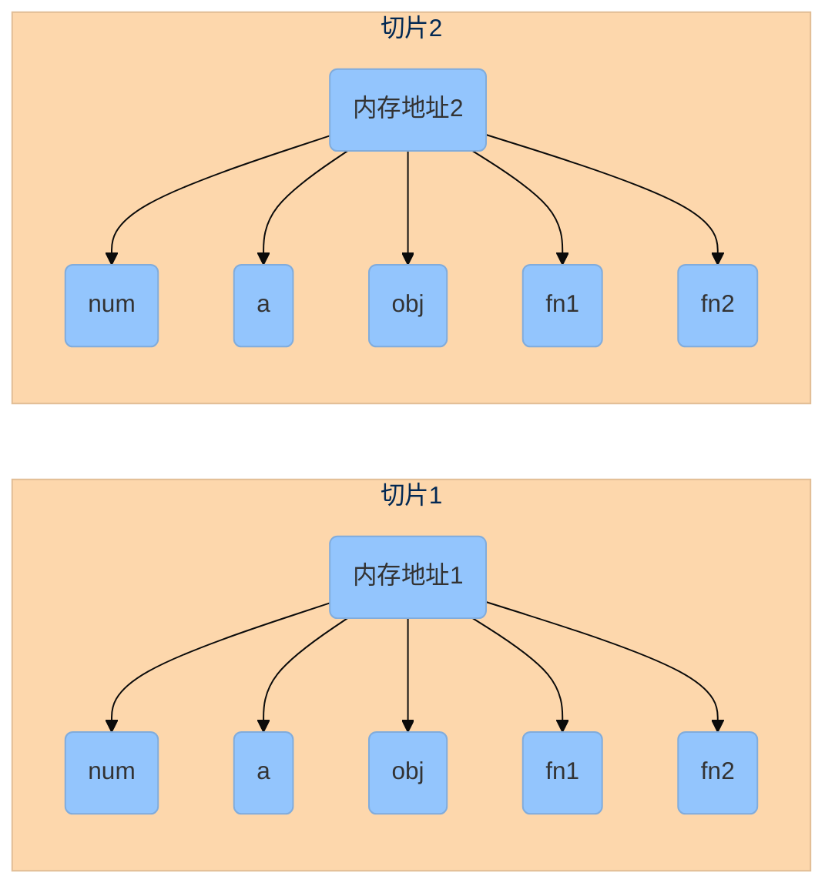
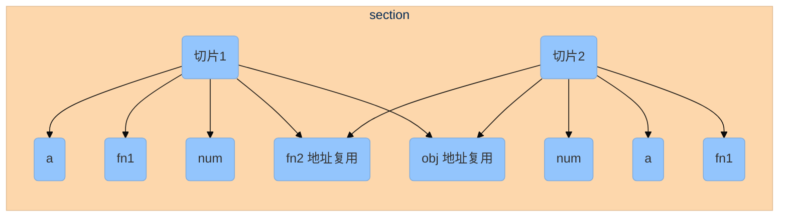

<!--
 * @Author: HfWang
 * @Date: 2023-05-31 19:04:18
 * @LastEditors: wanghaofeng
 * @LastEditTime: 2023-12-02 09:34:42
 * @FilePath: \whf-hooks-analysis\hooks\react-hooks.md
-->

# React Hooks 新手入坑指南


## 前言

:::tip 前言

- 想学习自定义 hooks 的源码，首先要知道 react 给我们提供了那些 hooks 的 api 或者说方法， 而本文将介绍一下几个日常开发中比较常用的 hooks
- 完整的 hooks 文档可以看 [react hooks api 官方文档](https://react.dev/reference/react)
:::

:::warning 为什么要学 hooks ？

- 文心一言：
  Hooks 是 React 16.8 版本中引入的新特性，它允许你在函数组件中使用 state 和其他 React 特性，
	使得函数组件更加灵活和易于理解。Hooks 的设计动机是为了解决函数组件在处理逻辑和状态时的限制，
	它通过将某些特定逻辑封装成小的、可复用的函数，使得函数组件可以像类组件一样使用 state 和其他 React 特性。

	`Hooks的实现基于JavaScript的闭包和原型链`，通过将这些hook函数添加到组件的原型链中，
	并在每次渲染时创建新的作用域和memorizedState属性，使得函数组件可以像类组件一样使用state和其他React特性。

	`Hooks的最大好处是简化了逻辑复用，`它使得函数组件的逻辑更加模块化和可复用，提高了代码的可读性和可维护性。
:::

### 案例一：逻辑复用

#### class Demo

:::code-group

```js [Demo1]
// 控制弹窗是否显示
class Demo1 extends Component {
	constructor(props) {
		super();
		this.state = {
			showModal,
		};
	}
	openModal = () => {
		this.setState({
			showModal: true,
		});
	};
	closeModal = () => {
		this.setState({
			showModal: false,
		});
	};
	// ....
	render() {
		return (
			<>
				<button onClick={this.openModal}></button>
				<Modal
					visiable={this.state.showModal}
					closeModal={this.closeModal}></Modal>
			</>
		);
	}
}

```

```js [Demo2]
// 控制文案内容
class Demo2 extends Component {
	constructor(props) {
		super();
		this.state = {
			show,
		};
	}
	toggleItem = () => {
		this.setState({
			show: !show,
		});
	};
	// ....
	render() {
		return (
			<>
				<button onClick={this.openModal}></button>
				<div>{this.state.show ? 'show' : 'hide'}</div>
			</>
		);
	}
}
```

:::

如上面代码所示，我们有两个组件，第一个组件通过一个按钮控制弹窗的出现，第二个组件通过按钮控制文案的显示

仔细观察我们可以发现，这两个我们开发过程中经常遇到的场景，实际上他们都有一个公共的逻辑——`就是通过一个变量的状态来修改视图`

在类组件时代，对于这部分逻辑实际上我们是不好把它提取为公共逻辑的：

- HOC：不太好处理，如果组件中只有一个变量用于控制状态还好，但是如果一个组件中存在多个类似的场景的话就不行了
- 把处理逻辑提取到组件之外：不符合 react 整个框架的设计思路 UI = f (data) （data →  state、props）

但是对于 hooks 来说，这个逻辑就很容易提取，我们把上面的公共逻辑提取为一个自定义 hooks

#### useBoolean

```ts
interface Actions<T> {
	setLeft: () => void
	setRight: () => void
	toggle: () => void
	set: (value: T) => void
}

function useBoolean(initData: boolean = false): [boolean, Actions] {
	const [value, setValue] = useState(initData);
	const actions = {
		setFalse: () => setValue(false),
		setTrue: () => setValue(true),
		toggle: () => setValue(!value),
		set: val => setValue(_val),
	};
	return [value, actions];
}
```

结合函数组件，上面的两个demo就可以换成这样的写法：

#### function Demo

::: code-group

```js [Demo1]
function Demo1(props) {
	const [showModal, modalActions] = useBoolean();
	return (
		<>
			<button onClick={modalActions.setTrue}></button>
			<Modal visiable={showModal} closeModal={modalActions.setFalse}></Modal>
		</>
	);
}

```

```js [Demo2]
function Demo1(props) {
	const [showText, textActions] = useBoolean();
	return (
		<>
			<button onClick={textActions.toggle}></button>
			<div>{showText ? 'show' : 'hide'}</div>
		</>
 	);
}

```
:::

但是，很多时候我们对状态的判断并不是只是 boolean 类型，比如一个状态的可选值为 `off / on`, `A/B`, `xxx/nnn` 等

所以我们可以把 useBoolean 在抽象一些

#### useToggle

```ts
interface Actions<T> {
	setLeft: () => void
	setRight: () => void
	toggle: () => void
	set: (value: T) => void
}
function useToggle<T>(
	leftValue: T = true, 
	rightValue: T = false
): [T, Actions<T>] {
	const [value, setValue] = useState<T>(leftValue);

	const actions = {
		setLeft: () => setValue(initData),
		setRight: () => setValue(rightValue),
		toggle: () => setValue(value === leftValue ? rightValue : leftValue),
		set: (value: T) => setValue(value)
	};

	return [value, actions]
}
```

如上面的代码，那么我们使用的时候可以这么用

```js
const [show, actions] = useToggle('off', 'on') // show --> off / on
const [open, { toggle }] = useToggle() // open --> boolean
```

但是这样还不够，无论是 useBoolean 还是 useToggle 都是针对两个状态之间的切换，那如果多个呢

比如常见的 tab 标签栏，再比如股票查看分时图、日k图、月k图、季度图等切换的操作，实际上都是属于多状态之间的切换


所以我们再把 useToggle 抽象一些，变成 useTogglePlus

#### useTogglePlus

```ts
interface Actions {
	setLeft: () => void
	setRight: () => void
	set: (index: number) => void
}

function useTogglePlus<T>(
	initIndex: number, 
	list: T[] =[]
): [T, Actions] {
	const [value, setValue] = useState<T>(list[initInde || 0] || '');
	const [index, setIndex] = useState<T>(initIndex || 0);
	
	const getIndex = (type: boolean = true): number => {
		const _leftIndex = index - 1 < 0 ? list.length - 1 : index - 1
		const _rightIndex = index + 1 > list.length ? 0 : index + 1
		const _index = type ? _rightIndex : _leftIndex
		setIndex(_index)
		return _index
	}

	const setLeft = () => {
		const _index = getIndex(false)
		setValue(list[_index]),
	}

	const setRight = () => {
		const _index = getIndex(true)
		setValue(list[_index]),
	}

	const set = (_index) => {
		if (_index < 0 || _index > list.length - 1) {
			throw new Error('对应下标的值不存在')
		}
		setValue(list[_index])
	}

	const actions = {
		setLeft,
		setRight,
		set
	};

	return [value, actions]
}
```

### 案例二：避免内存泄漏

#### class Demo

::: code-group

```js [SetTimeOutDemo]
let timer;
class SetTimeOutDemo extends Componet {
	componentDidMount() {
		timer = setTimeout(() => {
			// doSomething
		}, 10 * 1000);
	}

	componentDidUpdate() {
		if (timer) {
			clearTimeout(timer);
		}
		timer = setTimeout(() => {
			this.doSomthing();
		}, 10 * 1000);
	}	

	componentWillUnmount() {
		clearTimeout(timer);
	}

	doSomthing = () => {
		// ...
	};
	// ...
}
```

```js [EventListernDemo]
class EventListernDemo extends Component {
	constructor() {
		super();
		this.state = {
			num: 0,
		};
	}

	componentDidMount() {
		this.dom.addEventListener('touchStart', this.doSomthing1);
	}

	componentDidUpdate() {
		if (num > 10) {
			this.dom.addEventListener('click', this.doSomthing2);
		}
	}

	componentWillUnmount() {
		this.dom.removeEventListener('touchStart', this.doSomthing1);
		this.dom.removeEventListener('click', this.doSomthing2);
	}

	doSomthing1 = event => {
		// ...
	};

	doSomthing2 = event => {
		// ...
	};
	// ...
}
```

:::

上面的代码同样是两个组件
- 组件一：组件挂载或更新的时候，更新定时器，组件卸载的时候清空定时器
- 组件二：组件挂载时对指定节点开启 touchStart 监听，在 num 大于10时开启 click 监听，组件卸载的时候移除 touchStart 和 click 监听

这两个组件的逻辑很简单，但是如果我们在写的时候忘记在组件卸载的时候移除监听，那么就`存在内存泄漏的风险`

通用的，在类组件时代，如果我们想把添加监听和移除监听的操作抽离出来，也是比较困难的

但是使用 hooks，我们还是能很简单的把上面的风险点给移除

#### useSetTimeout + useEventListener

::: code-group
```ts [定时器 hook]
function useSetTimeout(
	fn: Function, 
	delay: number = 1000, 
	deps: any[] = []
) {
	useEffect(() => {
		let timer = setTimeout(() => fn?.(), delay);
		return () => clearTimeout(timer);
	}, deps);
}

```

```ts [事件监听 hook]
function useEventListener(
	dom: HTMLElemtent, 
	eventName: string, 
	callback: (e: Event) => void, 
	deps: any[] = []
) {
	useEffect(() => {
		dom?.addEventListener?.(eventName, callback);
		return () => dom?.removeEventListener?.(eventName, callback);
	}, deps);
}

```
:::

通过自定义 hooks 我们把定时器和事件监听事件都抽离出来了

下面时把上面的两个类组件更换成函数组件 + 我们自定义的 hooks

#### function Demo

::: code-group
```js [SetTimeOutDemo]
function SetTimeOutDemo() {
	useSetTimeout(doSomthing, 10 * 1000);

	const doSomthing = () => {
	// ...
	};
	// ...
}

```

```js [EventListernDemo]
function EventListernDemo() {
	const [num, setNum] = useState(0);
	useEventListener(dom, 'touchStart', doSomthing);
	useEffect(() => {
		if (num > 10) {
			useEventListener(dom, 'click', doSomthing);
		}
	}, [num, dom]);
	doSomthing1 = event => {
	// ...
	};
	doSomthing2 = event => {
	// ...
	};
	// ...
}

```
:::

通过这两个案例，应该能大致理解为什么要有 hooks 了吧，那后面就开始说下几个比较常用的官方 hooks 吧

### 常用 hooks 分类 

对于常用的 react hooks，我把他们分为 3 类:



## 状态相关

### useState

```js{1,4,8-9}
import { useState } from "react";

const Demo = () => {
	const [count, setCount] = useState(0);
	return (
		<div>
			{count}
			<button onClick={() => setCount(count++)}>count+1</button>
			<button onClick={() => setCount((e) => (e += 2))}>count+2</button>
		</div>
	);
};
```

### useContext

这个一般是用于跨多层级组件之间的通信的，如葫芦娃爷爷和葫芦娃之间的通信, 一般搭配 createContetx

:::code-group

```tsx [index.jsx]{1,4,10-12}
import Son from './Son';

const initData: UserData = {};
const UserCtx = createContext<UserData>(initData);

const Demo = () => {
	const userData = fetch('xxx'); // 假设异步获取

	return (
		<UserCtx.UserCtx value={userData}>
			<Son />
		</UserCtx.UserCtx>
	);
};
```

```jsx [Son.jsx]{1,4}
import Grandson from './Grandson';
const Son = () => (
	<div>
		<Grandson />
	</div>
);
```

```jsx [Grandson.jsx]{2}
const Grandson = () => {
	const userCtx: UserData = useContext(UserCtx);
	return <div>...</div>;
};
```

:::

## 副作用相关

### useEffect

```js
/**
 * @param {function} effect
 * @param {Array} deps
 * @returns {void}
 */
useEffect(effect, deps);
```

#### effect 执行时机

:::code-group

```jsx [deps 不存在]{7-9}
import { useEffect, useState } from 'react';

const Demo = () => {
	const [count, setCount] = useState(0);
	const [num, setNum] = useState(0);

	useEffect(() => {
		console.log('无论是自身那个状态发生变化导致的更新或者是祖先组件导致的更新，我这里每次都会触发');
	});
	return (
		<div>
			<p>
				num: {num} count:{count}
			</p>
			<button onClick={() => setCount(count++)}>count</button>
			<button onClick={() => setNum(num++)}>num</button>
		</div>
	);
};
```

```jsx [deps 为空数组]{4-6}
import { useEffect, useState } from 'react';

const Demo = () => {
	useEffect(() => {
		console.log('我只在组件创建时触发，后续任何情况导致的组件更新，我都不会在执行了');
	}, []);

	return (
		<div>
			<p>
				num: {num} count:{count}
			</p>
		</div>
	);
};
```

```jsx [deps 有值]{7-9}
import { useEffect, useState } from 'react';

const Demo = () => {
	const [count, setCount] = useState(0);
	const [num, setNum] = useState(0);

	useEffect(() => {
		console.log('我只在 count 变量发生变化时才触发');
	}, [count]);
	return (
		<div>
			<p>
				num: {num} count:{count}
			</p>
			<button onClick={() => setCount(count++)}>count</button>
			<button onClick={() => setNum(num++)}>num</button>
		</div>
	);
};
```

:::

useEffect 第二个参数：

- 不传



- 传空数组



- 数组不为空
  - 数组里为简单数据类型
  - 数组里为复杂数据类型



如果 useEffect 的依赖项数组中包含对象，React 会检查对象属性是否发生变化。

如果属性的顺序、值或对象本身引用发生变化，则会触发 useEffect。

react 中的源码:

```ts
// shallowEqual.js
import is from './objectIs' // 浅比较
import hasOwnProperty from './hasOwnProperty'

function shallowEqual(objA: mixed, objB: mixed): boolean {
	// 先判断内存地址是否一致
  if (is(objA, objB)) return true;
	// 判断是否是对象
  if (
    typeof objA !== 'object' || objA === null ||
    typeof objB !== 'object' || objB == null
  ) {
    return false
  }

	// 获取对应的 key
  const keysA = Objects.keys(objA)
  const keysB = Objects.keys(objB)

	// 如果 key 的数量不一致，则直接返回 false
  if (keysA.length !== keysB.length) {
    return false
  }

	// key 数量一致对应的 key 进行浅比较
  for (let i = 0; i < keysA.length; i++) {
    const currentKey = keysA[i]
    if (
      !hasOwnProperty.call(objB, currenrtKey) ||
      !is(objA[currentKey], objB[currentKey])
    ) {
      return false
    }
  }
  return true
}
```


#### effect 中 clear 函数的执行时机

- 首次渲染：不会执行 useEffect 里面的 return 函数
- 组件重新 render，useEffect 执行时，`会先执行 useEffect 里面的 return 函数，后面在执行非 return 部分的代码`

:::code-group

```jsx [deps 为空]{6-10}
import { useEffect, useState } from 'react';

const Demo = () => {
	const [count, setCount] = useState(0);

	useEffect(() => {
		return () => {
			console.log('我在组件卸载时触发');
		};
	}, []);
	return (
		<div>
			<p>count:{count}</p>
			<button onClick={() => setCount(count++)}>count</button>
		</div>
	);
};
```

```jsx [deps 有值]{6-10}
import { useEffect, useState } from 'react';

const Demo = () => {
	const [count, setCount] = useState(0);

	useEffect(() => {
		return () => {
			console.log('我在 count 导致的下一次渲染之前执行');
		};
	}, [count]);
	return (
		<div>
			<p>count:{count}</p>
			<button onClick={() => setCount(count++)}>count</button>
		</div>
	);
};
```

:::



### uselayoutEffect

略，基础语法和 useEffect 一模一样，只有 effect 执行时机不一致，具体可以看下面的执行时机图：


useLayoutEffect 主要用于模拟 uselaytmeffect 行为，其实现原理是将 useEffect 的依赖项数组中添加 shallowCompare 函数，使得 useEffect 在每次使用浅比较时，都会触发重渲染并执行 useLayoutEffect。

`useLayoutEffect 可以用于处理可能需要阻塞视图的副作用，如节流、防抖、重排等`

但是，官方建议尽量使用 useEffect，以避免阻塞视觉更新。

## 性能优化相关

### 原理简介

了解这几个 hooks 需要先知道`时间切片`这个概念

比如现在有一个变量 num 从 1 ==> 2, 对于 react 来说就是存在两个时间切片

- 切片 1：num = 1
- 切片 2：num = 2

而对于一个时间切片来说，它上面包含了一个组件上的所有`数据，包括状态、函数`等

比如下面这个例子

```js{2,4}
let num = 1, a = 0;
const obj = { a };
const fn1 = () => num++;
const ffn2 = () => a++;
```

对于 react 来说，每次状态发生变化，都会重新生成一个对象，对于上面这个例子了来说就是，`num 变化了`，react 会生成新的 num、a、obj、fn1、fn2，即

- 切片 1： num a obj fn1 fn2
- 切片 2： num a obj fn1 fn2 （全都是新的内存地址，只是变量和函数的名称一致）



但是`对于 fn2 和 obj 来说，其实它们都不依赖 num`，所以我们希望在更新的时候，如果函数或变量本身并不依赖到变化的变量，任然能使用上一切片时间的变量和函数，
即 obj 和 fn2 在更新的时候任然使用 切片 1 的 obj、fn2 对应的内存地址，这样在更新的时候就可以减少一部分的性能开销，如图所示



> 这里如果熟悉 vue 的话可以来理解为 vue 里面的 computed

针对这种场景下的需求，react 为我们提供了这么几个 hooks

- useRef
- useMemo
- useCallback

`那什么时候能使用更新前的内存地址呢? 什么是需要创建新的内存地址呢？`

react 的 useMemo 和 useCallback 是通过第二个参数来判断的

> 同 useEffect 一样，会对第二个参数进行比较，如果依赖项的数据发生了变化，就创建新的内存地址，如果第二个参数是空数组的话，即创建之后，之后组件的每一次跟新，被 `useMemo / useCallback` 包装过的变量、函数都不会在发生变化

```js
const Demo = () => {
	const a = useRef(0);
	const fn1 = useCallback(() => console.log(a.current), []);
	const fn2 = useCallback(() => console.log(a.current), [a]);

	return <div>....</div>;
};
```

如上，假设 a 变成了 1，让后去执行 fn1 和 fn2，这是会发现，fn1 打印的还是 0， 而 fn2 打印的是 1，这就是上面说的时间切片导致的，

- 时间切片 1 a = 0 fn1 里面的 a.current = 0, fn2 里面的 a.current = 0
- 时间切片 2 a = 1 fn1 里面的 a.current = 0, fn2 里面的 a.current = 1

:::tip
因为 fn1 的依赖项是空的，即 时间切片 2 中的 fn1 指向的内存地址还是时间内切片 1 中 fn1 所在的内存地址，所以 fn1 函数里面的 a 一直是第一个时间切片里面的数值，所以执行 fn1 的时候还是打印的 0，而 fn2 依赖性数值包含了 a, 所以在 a 发生变化的时候，在时间切片 2 中就会生成一个新的内存地址，函数里面的 a 变量就是时间切片 2 里面的 a 变量
:::

这就是 hooks 经常被提及的会导致 `闭包` 问题

### useMemo

```js
/**
 * @param {function} fn
 * @param {array} deps
 * @returns {any}
 */
useMemo(fn, deps);
```

```jsx{8-9}
import React, { useMemo, useState } from "react";

export default function Demo() {
	const [num1, setNum1] = useState(0);
	const [num2, setNum2] = useState(0);
	const [num3, setNum3] = useState(0);

	const memoFn1 = useMemo(() => setNum((num1) => num1++), []);
	const memoFn2 = useMemo(() => setNum((num2) => num2++), [num2]);
	const fn3 = () => setNum((num) => num++);

	return (
		<div>
			<p>{num1}</p>
			<button onCLick={memoFn1}></button>
			<p>{num2}</p>
			<button onCLick={memoFn2}></button>
			<p>{num1}</p>
			<button onCLick={fn3}></button>
		</div>
	);
}
```

### useCallback

```js
/**
 * @param {function} fn
 * @param {array} deps
 * @returns {function}
 */
useCallback(fn, deps);
```

useCallback 实际上是 useMemo 的延申

```js{2,4}
const fn1 = () => {};
useCallback(() => fn1(), [xxx]);
等价于;
useMemo(() => () => fn1(), [xxx]);
```

### useRef

相比于 setState 每次跟新都会生成一个新的对象，useRef 返回的对象内存地址时不变的，使用场景一般用于复杂类的实例创建

> useRef 创建的是一个普通 Javascript 对象，而且会在每次渲染时返回同一个 ref 对象，当我们变化它的 current 属性的时候，对象的引用都是同一个

:::code-group

```js [作为地址不变数据使用]
import { useRef } from 'react';

const Demo = () => {
	const count = useRef(0);
	return (
		<div>
			{count}
			<button onClick={() => count.current++}>count+1</button>
		</div>
	);
};
```

```jsx [作为绑定dom的元素使用]
import { useRef } from 'react';

const Demo = () => {
	const divRef = useRef(null);
	return <div ref={divRef}></div>;
};
```

:::

## 自定义 hooks

### 组件挂载和组件卸载

```js
import { useEffect, useRef } from 'react';

export function useMount(fn) {
	useEffect(() => {
		fn?.();
	}, []);
}

export function useUnmount(fn) {
	const fnRef = useRef(fn);
	useEffect(() => () => fnRef.current?.(), []);
}
```

### 组件更新

```js
import { useEffect, useRef } from 'react';

export function useUpdateEffect(fn, deps) {
	const isMount = useFisrtMount();
	useEffect(() => {
		if (!isMount.current) {
			fn?.();
		}
	}, deps);
}

export function useFisrtMount() {
	const isMount = useRef(true);

	useEffect(() => {
		return () => (isMount.current = false);
	});

	return isMount;
}
```

### 类组件写法扩展

```js
export function useSetState(initData) {
	const [store, setStore] = useState(initData);

	const setStoreState = value => {
		setStore({
			...store,
			...value,
		});
	};

	return [store, setStoreState];
}
```

### 监听事件

```js
export function useEvent({ dom, callback, eventName }, deps = []) {
	const target = getDom(dom);
	useEffect(() => {
		target?.addEventListener?.(eventName, callback);
		return () => target?.removeEventListener?.(eventName, callback);
	}, deps);
}

export function getDom(el) {
	if (typeof el === 'string') {
		return document.querySelector(el);
	} else if (typeof el === 'object' && el.hasOwnProperty('current')) {
		return el.current;
	} else {
		return el;
	}
}
```

### 请求策略

:::code-group

```jsx [基础版本] {7-11,32-35}
export function useRequest(http, options) {
	const config = {
		manual: false, // 是否手动执行
		...options,
	};

	useMount(() => {
		if (!config.manual) {
			run();
		}
	});

	const [loading, setLoading] = useState(false);
	const [data, setData] = useState(null);
	const [error, setError] = useState(null);

	const run = async () => {
		setLoading(true);
		try {
			const res = await http();
			setData(res);
			setLoading(false);
			setError(null);
		} catch (err) {
			setData(null);
			setError(err);
			setLoading(false);
		}
	};

	return {
		run,
		data,
		error,
		loading,
	};
}
```

```jsx [新增自定义回调] {4-6,22,29,34}
export function useRequest(http, options) {
	const config = {
		manual: false,
		beforeRequest: null,
		onSuccess: null,
		onError: null,
		...options,
	};

	useMount(() => {
		if (!config.manual) {
			run();
		}
	});

	const [loading, setLoading] = useState(false);
	const [data, setData] = useState(null);
	const [error, setError] = useState(null);

	const run = async () => {
		const { beforeRequest, onError, onSuccess } = config;
		beforeRequest?.();
		setLoading(true);
		try {
			const res = await http();
			setData(res);
			setLoading(false);
			setError(null);
			onSuccess?.(res);
		} catch (err) {
			setData(null);
			setError(err);
			setLoading(false);
			onError?.(err);
		}
	};

	return {
		run,
		data,
		error,
		loading,
	};
}
```

```jsx [新增缓存] {1,9,27-32,48,55}
const cacheMap = new Map();

export function useRequest_2(http, options) {
	const config = {
		manual: false,
		beforeRequest: null,
		onSuccess: null,
		onError: null,
		cacheKey: null, // 缓存 key
		...options,
	};

	useMount(() => {
		if (!config.manual) {
			run();
		}
	});

	const [loading, setLoading] = useState(false);
	const [data, setData] = useState(null);
	const [error, setError] = useState(null);

	const run = async () => {
		const { beforeRequest, onError, onSuccess, cacheKey } = config;
		beforeRequest?.();
		setLoading(true);
		if (cacheKey && cacheMap.has(cacheKey)) {
			setData(cacheMap.get(cacheKey));
			setLoading(false);
			setError(null);
			onSuccess?.(res);
		} else {
			try {
				const res = await http();
				setData(res);
				setLoading(false);
				setError(null);
				onSuccess?.(res);
				if (cacheKey) {
					cacheMap.set(cacheKey, res);
				}
			} catch (err) {
				setData(null);
				setError(err);
				setLoading(false);
				onError?.(err);
			}
		}
	};

	const clearCache = () => cacheMap.delete(cacheKey);

	return {
		run,
		data,
		error,
		loading,
		clearCache,
	};
}
```

```js [新增缓存有效期] {10,28-37,64-70}
const cacheMap = new Map();

export function useRequest_2(http, options) {
	const config = {
		manual: false,
		beforeRequest: null,
		onSuccess: null,
		onError: null,
		cacheKey: null,
		period: null, // 有效期时长， number，单位毫秒
		...options,
	};

	useMount(() => {
		if (!config.manual) {
			run();
		}
	});

	const [loading, setLoading] = useState(false);
	const [data, setData] = useState(null);
	const [error, setError] = useState(null);

	const run = async () => {
		const { beforeRequest, onError, onSuccess, cacheKey } = config;
		beforeRequest?.();
		setLoading(true);
		if (cacheKey && cacheMap.has(cacheKey)) {
			const res = cacheMap.get(cacheKey);
			if (cacheDataInPeriod()) {
				setData(res.value);
				setLoading(false);
				setError(null);
				onSuccess?.(res);
			} else {
				clearCache();
				runAsync();
			}
		} else {
			runAsync();
		}
	};

	const runAsync = async () => {
		try {
			const res = await http();
			setData(res);
			setLoading(false);
			setError(null);
			onSuccess?.(res);
			if (cacheKey) {
				cacheMap.set(cacheKey, {
					value: res,
					time: Date.now(),
				});
			}
		} catch (err) {
			setData(null);
			setError(err);
			setLoading(false);
			onError?.(err);
		}
	};

	const cacheDataInPeriod = () => {
		const { period } = config;
		return period
			? // 有传入缓存有效期的话就判断一下
			  Date.now() - cacheMap.get(cacheKey).time < period
			: true; // 没有执行返回 true
	};

	const clearCache = () => cacheMap.delete(cacheKey);

	return {
		run,
		data,
		error,
		loading,
		clearCache,
	};
}
```

```js [插件式开发]

plugins.forEach(plugin => plugin?.[action]?.(...))
```

## 总结

大侠，你怎么比我还懒啊。

啊，我懒得写总结，你懒得看内容是吧，要看总结，自己看完内容写去。。。。
